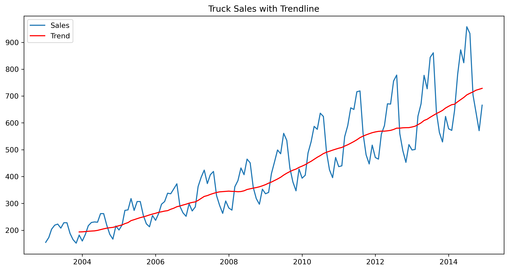
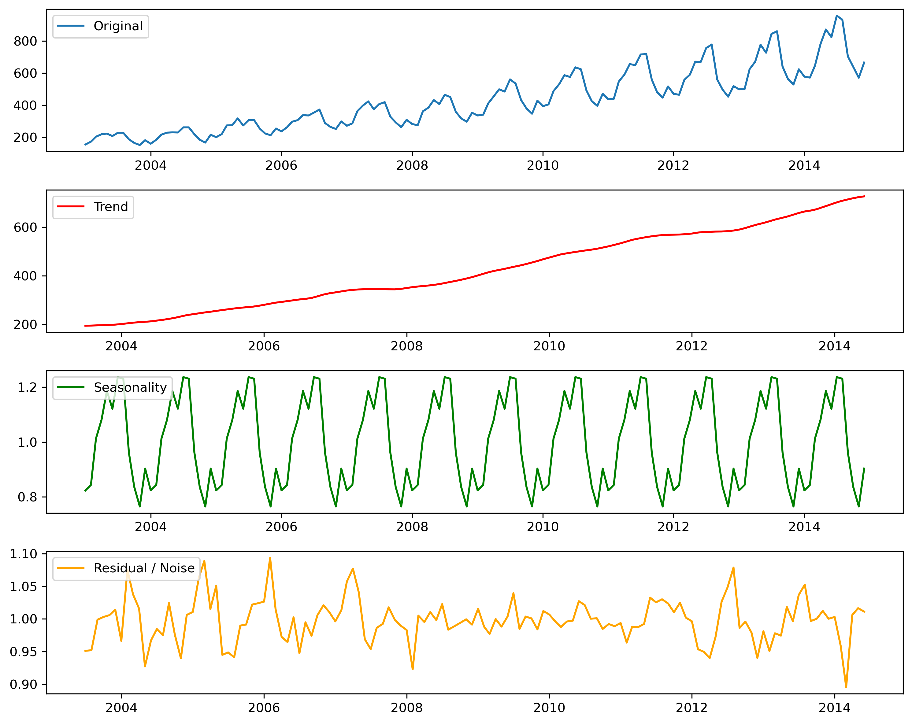
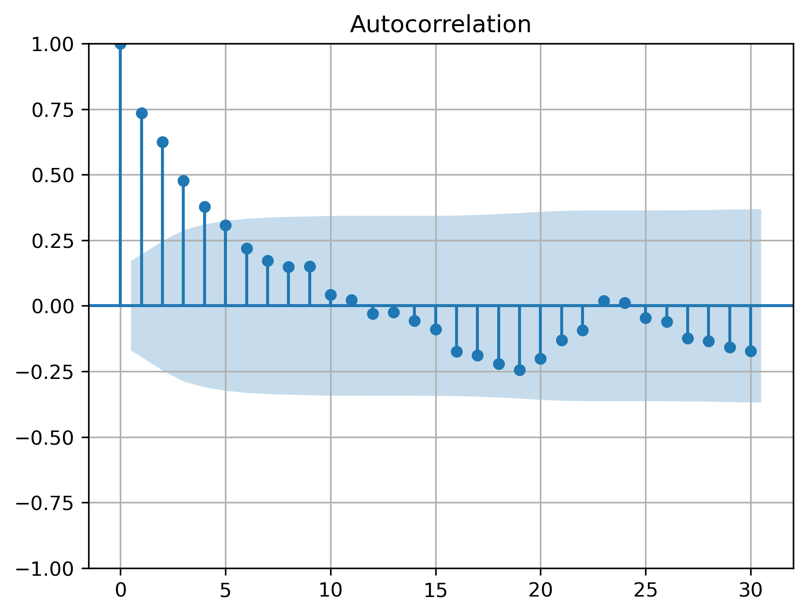
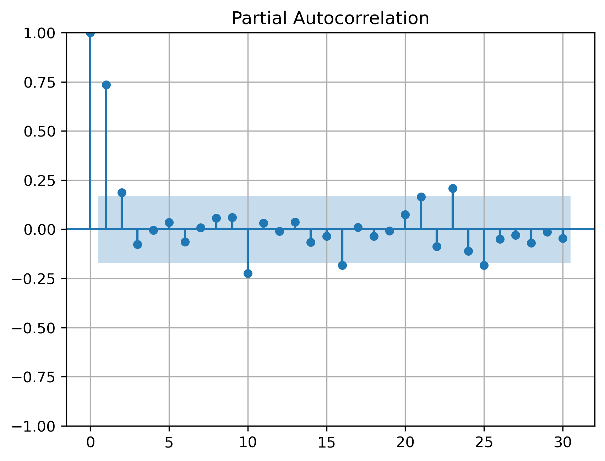
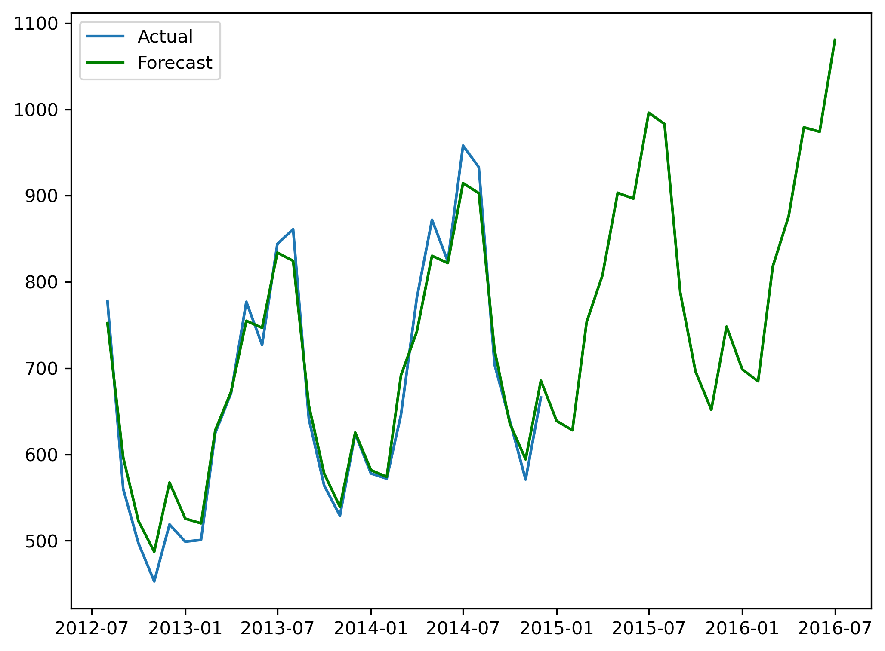

# Time Series Forecasting of Truck Sales Using SARIMA (Python)

**Data Science Capstone Project – TS Academy**

## Project Overview
This project was completed as part of the TS Academy Data Science Capstone Project.

The objective of this analysis is to forecast truck sales using time series modeling techniques. The project follows a complete workflow including data preprocessing, exploratory data analysis, decomposition, stationarity testing, differencing, model building, forecasting, and evaluation.

## Key Results
- The SARIMA model successfully captured the seasonal pattern in the truck sales data.
- The model achieved:
  - RMSE: 25.98
  - MAE: 21.47
- Forecast results show stable short-term predictions aligned with historical trends.
- The model demonstrates strong capability in capturing seasonality but may be limited by external economic factors not included in the dataset.

## Problem Statement
Truck sales data changes over time and may contain trends and seasonal patterns. The goal of this project is to analyze historical truck sales data and build a forecasting model that can predict future sales as accurately as possible.

## Dataset
The dataset used in this project is a truck sales dataset containing time-based sales records.

Main variables include:

- **Month** – date of observation
- **Sales** – number of truck units sold

The dataset is suitable for time series analysis because observations are recorded sequentially over time.

**File included in this repository:**
- `data/truck_sales.csv`

## Project Workflow
The notebook covers these stages:

1. Data loading and preprocessing  
2. Exploratory data analysis  
3. Time series visualization  
4. Time series decomposition  
5. Stationarity testing using the Augmented Dickey-Fuller test  
6. Differencing transformation  
7. ACF and PACF analysis  
8. Train-test split  
9. SARIMA model building  
10. Forecasting and evaluation using RMSE and MAE  
11. Residual analysis and diagnostics  
12. Final conclusions and recommendations

## Visual Results

### Time Series Trend


### Decomposition


### ACF & PACF




### Forecast vs Actual


## Model

A **SARIMA model** was used to capture both trend and seasonal patterns in the truck sales data.

Evaluation metrics used:

- RMSE (Root Mean Squared Error)
- MAE (Mean Absolute Error)

The model successfully captures the seasonal behavior in the data and produces reasonable forecasts.

## Insights
The analysis reveals that truck sales exhibit a clear seasonal pattern, with recurring peaks and declines across specific time periods.

This suggests that external factors such as business demand cycles, economic conditions, and purchasing trends influence sales behavior.

The SARIMA model effectively captures this seasonality, making it suitable for short-term forecasting and planning.

## How to Run the Project

1. Clone the repository 
```git clone https://github.com/Azo-rocks/TS_Academy_Capstone_Project.git```
2. Install required libraries 
`pip install -r requirements.txt`
3. Open the notebook 
```jupyter notebook``` 
4. Run the notebook: 
`notebooks/Capstone_grp_16.ipynb`

## Tools and Libraries
- Python
- Pandas
- NumPy
- Matplotlib
- Statsmodels
- Scikit-learn
- Jupyter Notebook

## Repository Contents
- `data/` → dataset used in analysis  
- `notebooks/` → Jupyter notebook containing the analysis  
- `images/` → visualization outputs  
- `report/` → project summary  
- `README.md` → project documentation  
- `requirements.txt` → project dependencies  

## Key Skills Demonstrated
- Time series analysis
- Data preprocessing
- Stationarity testing
- Seasonal decomposition
- SARIMA forecasting
- Forecast evaluation
- Residual diagnostics
- Data storytelling

## Author
AbdulAzeem Shorunke  
Statistics Graduate | Data Science & Financial Analytics  
Python • Time Series Analysis • Machine Learning

## Note
This repository was created as part of my Data Science learning journey and demonstrates my ability to complete an end-to-end time-series forecasting project in Python.
